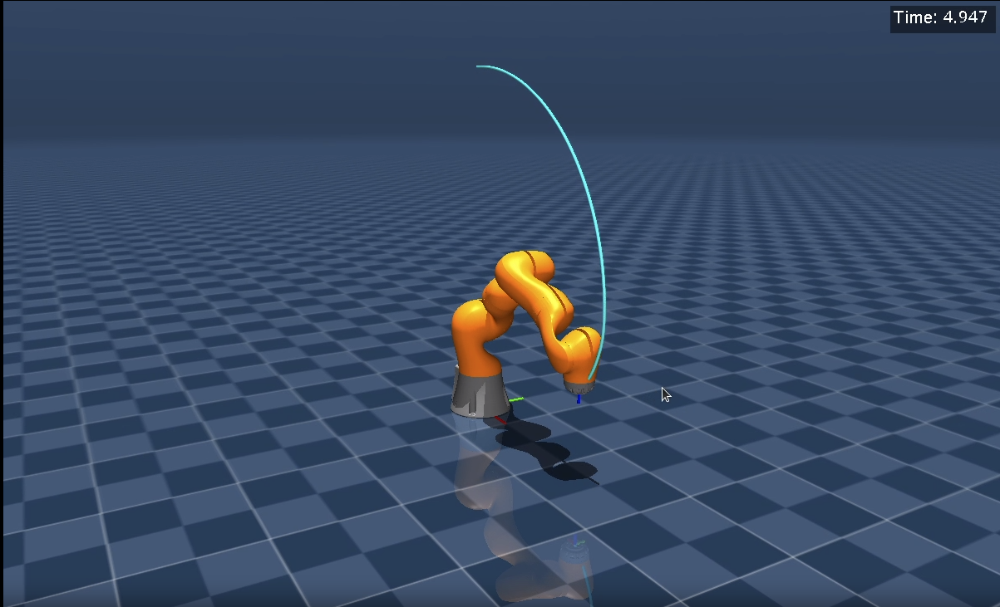
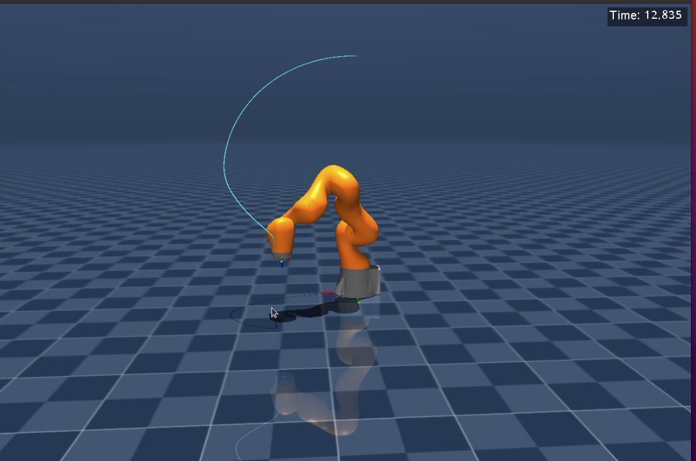

# 机械臂学习（pinocchio、mujoco、control algorithm）  
---
## 7自由度机械臂逆运动学求解
- demo_dyn.cpp.cpp  通过阻尼最小二乘求解，底层控制增加力矩前馈后，pinocchio与mujoco显示的最终位置一致了，且与期望位置无误差。
- https://www.bilibili.com/video/BV1nrhWzhEES/?spm_id_from=333.1387.homepage.video_card.click&vd_source=00acc89def32b3140ee30658648c4c5e
- 

## 7自由度机械臂OMPL-RRTConnect轨迹规划
- demo_traj_plan.cpp 设定期望的笛卡尔位姿，使用Pinocchio进行逆解得到期望关节值，将其传入OMPL规划器内，作为目标状态，调用规划器求解，得到关节值序列，索引每个序列的值，作为每个周期的期望值，最后mujoco中使用PD+力矩前馈进行控制，可视化轨迹。
- https://www.bilibili.com/video/BV1UGb5zkE5M/?vd_source=00acc89def32b3140ee30658648c4c5e
- 
